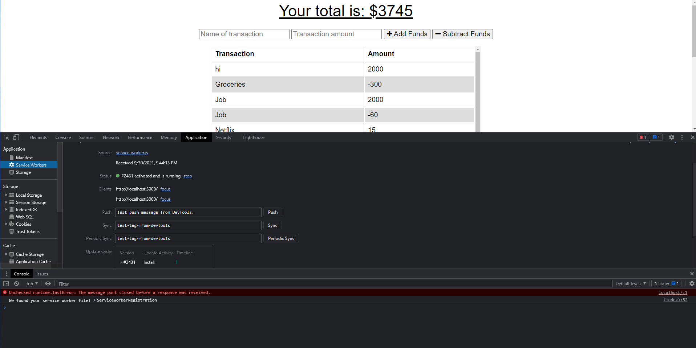

<br />
  <h3 align="center">Budget Tracker</h3>

  <p align="center">
    Track your budget offline and online with this tracker.
    <br />
    <a href="https://github.com/BaileyB227/BudgetTracker"><strong>Explore the docs »</strong></a>
    <br />
    <br />
    <a href="https://github.com/BaileyB227/BudgetTracker">View Demo</a>
    ·
    <a href="https://github.com/BaileyB227/BudgetTracker/issues">Report Bug</a>
    ·
    <a href="https://github.com/BaileyB227/BudgetTracker/issues">Request Feature</a>
  </p>
</p>

<details open="open">
  <summary>Table of Contents</summary>
  <ol>
    <li>
      <a href="#about-the-project">About The Project</a>
      <ul>
        <li><a href="#deployed">Deployed</a></li>
        <li><a href="#built-with">Built With</a></li>
      </ul>
    </li>
    <li>
      <a href="#getting-started">Getting Started</a>
      <ul>
        <li><a href="#prerequisites">Prerequisites</a></li>
        <li><a href="#installation">Installation</a></li>
      </ul>
    </li>
    <li><a href="#contributing">Contributing</a></li>
    <li><a href="#license">License</a></li>
    <li><a href="#contact">Contact</a></li>
  </ol>
</details>

## About The Project



## Depoloyed

https://tranquil-island-91040.herokuapp.com/

### Built With

This section should list any major frameworks that you built your project using. Leave any add-ons/plugins for the acknowledgements section. Here are a few examples.

- Javascript
- webmanifest
- service-worker

## Getting Started

This is an example of how you may give instructions on setting up your project locally.
To get a local copy up and running follow these simple example steps.

### Prerequisites

This is an example of how to list things you need to use the software and how to install them.

- npm
  ```sh
  npm install npm@latest -g
  ```

### Installation

1. Get a free API Key at [https://example.com](https://example.com)
2. Clone the repo
   ```sh
   git clone https://github.com/BaileyB227/BudgetTracker.git
   ```
3. Install NPM packages
   ```sh
   npm install
   ```
4. Enter your API in `config.js`
   ```JS
   const API_KEY = 'ENTER YOUR API';
   ```

## Contributing

Contributions are what make the open source community such an amazing place to be learn, inspire, and create. Any contributions you make are **greatly appreciated**.

1. Fork the Project
2. Create your Feature Branch (`git checkout -b feature/AmazingFeature`)
3. Commit your Changes (`git commit -m 'Add some AmazingFeature'`)
4. Push to the Branch (`git push origin feature/AmazingFeature`)
5. Open a Pull Request

<!-- LICENSE -->

## License

Distributed under the MIT License. See `LICENSE` for more information.

## Contact

Bailey Bennett - BaileyB227@gmail.com

Project Link: [https://github.com/BaileyB227/BudgetTracker](https://github.com/BaileyB227/BudgetTracker)
